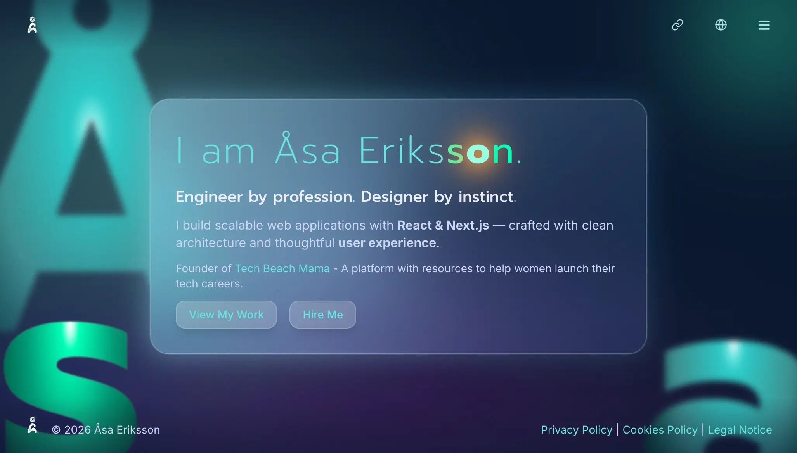

# Åsa Eriksson — Portfolio

Trilingual portfolio and case-study site. Next.js 16 App Router, React 19, TypeScript.

**Live:** [asaeriksson.com](https://asaeriksson.com)



## What this is

A personal site for a product developer and designer: an about page, a services page, and five long-form project case studies, each written in English, Swedish and Spanish. It is built to be read by prospective clients and hiring managers, so the effort went into content structure, motion, and getting three languages right. There is no CMS or database — all content is version-controlled in the repo.

## Stack

- Next.js 16.1.6 (App Router, Turbopack), React 19.2.3, TypeScript 5 (`strict`)
- Tailwind CSS 3.4 over CSS custom properties, plus three CSS Modules for effects Tailwind can't express
- next-intl 4 — three locales, path-prefixed routing via middleware
- Framer Motion 12 for animation; React 19 `<ViewTransition>` for cross-route morphs
- shadcn/ui with Radix primitives (Button, Card, DropdownMenu)
- next-themes, Lucide icons
- Deployed on Vercel

## Engineering notes

**Content is modelled as data, not pages.** A case study is one entry in `src/app/[locale]/portfolio/portfolioProjects.ts` (slug, date, tags, image pairs) plus one block in `src/messages/*.json`, joined by a `text` key. Adding a project means editing data. A page per project would have made three-language parity impractical to maintain.

**The portfolio grid and detail page share a transitioning element.** The card thumbnail and the detail hero carry the same `<ViewTransition name>`, so the image morphs across the navigation. Framer Motion's entry animation is disabled on that element (`initial={false}` in `HeroSection.tsx`) — without it, both systems animate the same node and it stutters.

**Design tokens sit in two layers.** `tokens.css` holds structural values (spacing, type scale, radii); `themes.css` holds semantic colour, redefined under `.dark`. Tailwind maps each through `hsl(var(--token) / <alpha-value>)` so opacity modifiers still work. Dark mode swaps the underlying colour ramp rather than only the semantic aliases, because a palette tuned for light backgrounds does not invert cleanly.

**Reusable UI lives outside the app.** `packages/ui/` holds app-agnostic components reached through an `@/ui` path alias. It is deliberately not a workspace package — at this size the import boundary is enough, and it avoids the build tooling.

**The heaviest visual is client-only.** The animated background letters load through `dynamic(..., { ssr: false })` and respect `prefers-reduced-motion`.

## Local setup

```bash
npm install
npm run dev
```

Opens at `http://localhost:3000` and redirects to `/en`.
